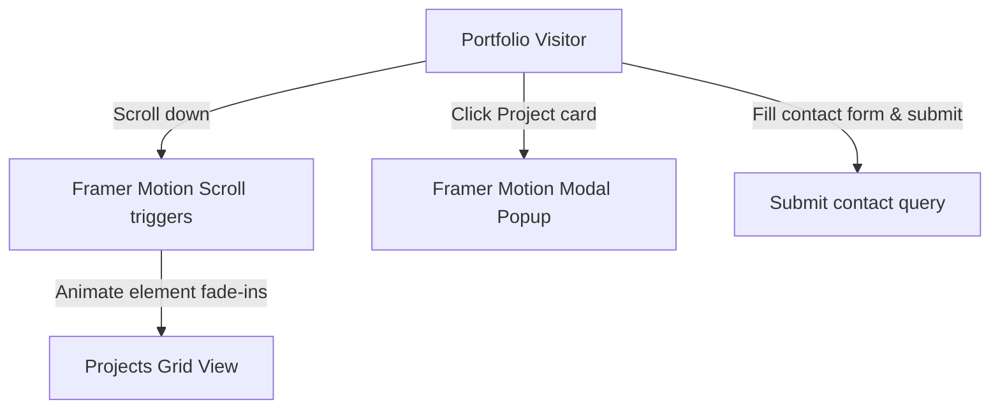

# UI/UX Designer Portfolio: Interactive Design Showcase

<div align="center">
  
</div>

<div align="center">
     
</div>

موقع **معرض أعمال مصممة واجهات المستخدم (UI/UX)** التفاعلي، قمت بتطوير وبرمجة الواجهة الأمامية بالكامل باستخدام React ومكتبة Framer Motion لعرض التصاميم ونماذج العمل بصورة احترافية حركية.

An interactive, high-fidelity portfolio website developed for a professional UI/UX Designer. Designed by the UI/UX designer and developed end-to-end as a React frontend client by Sayed Herzallah.

---

## 🧬 UI Component & Animation Flow

The frontend manages smooth layout transitions and contact triggers:



---

## 🛠️ Technology Stack & Assets

*   **Library**: **React 18** + **Vite**.
*   **Animation Engine**: **Framer Motion** managing entry, exit, and scroll states.
*   **Design**: **TailwindCSS** customized typography grids.

---

## 📂 Repository Module Layout

```text
uiux-portfolio-react/
├── src/
│   ├── components/      # ProjectCard, ContactForm, Navbar
│   ├── assets/          # Project graphics and logo assets
│   ├── App.jsx          # Showcase page controller
│   └── main.jsx         # Render entry point
├── package.json         # Node metadata
└── README.md            # System documentation
```

---

## ⚡ Local Setup & Run
```bash
git clone https://github.com/Sayed-Herzallah/uiux-portfolio-react.git
cd uiux-portfolio-react
npm install
npm run dev
```

---

## 📄 License
Licensed under the **MIT License**.
