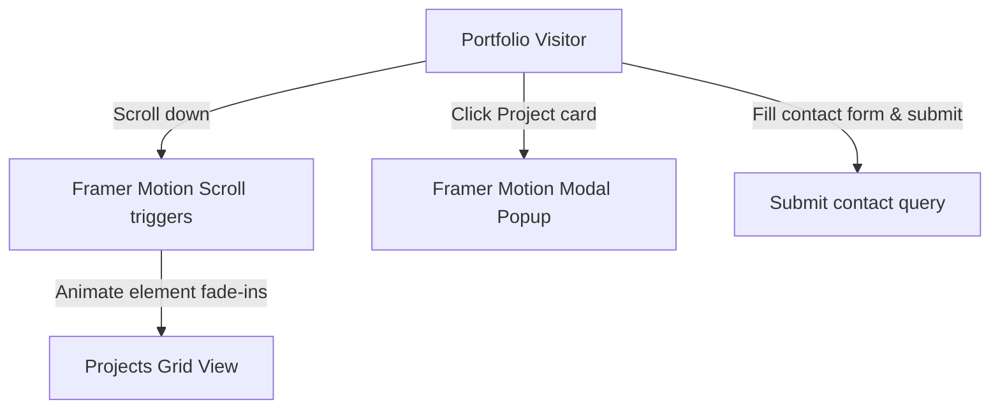

# Sayed Herzallah Portfolio: Animated Interactive Developer Showcase

<div align="center">
  
</div>

<div align="center">
     
</div>

موقع **معرض الأعمال التفاعلي** للمهندس سيد حرز الله هو واجهة تعريفية متقدمة مبنية باستخدام React ومكتبة Framer Motion لإتاحة تجربة تصفح تفاعلية وحركية تستعرض مشاريعه الرائدة وخبراته الهندسية.

This repository holds the interactive portfolio frontend client for **Sayed Herzallah's Developer Showcase**. Featuring Framer Motion scroll triggers, project details popups, and a responsive contact form.

---

## 🧬 UI Component & Animation Flow

The frontend manages smooth layout transitions and contact triggers:



---

## 🛠️ Technology Stack & Assets

*   **Library**: **React 18** + **Vite**.
*   **Animation Engine**: **Framer Motion** managing entry, exit, and scroll states.
*   **Design**: **TailwindCSS** customized typography grids.

---

## 📂 Repository Module Layout

```text
uiux-portfolio-react/
├── src/
│   ├── components/      # ProjectCard, ContactForm, Navbar
│   ├── assets/          # Project graphics and logo assets
│   ├── App.jsx          # Showcase page controller
│   └── main.jsx         # Render entry point
├── package.json         # Node metadata
└── README.md            # System documentation
```

---

## ⚡ Local Setup & Run
```bash
git clone https://github.com/Sayed-Herzallah/uiux-portfolio-react.git
cd uiux-portfolio-react
npm install
npm run dev
```

---

## 📄 License
Licensed under the **MIT License**.
